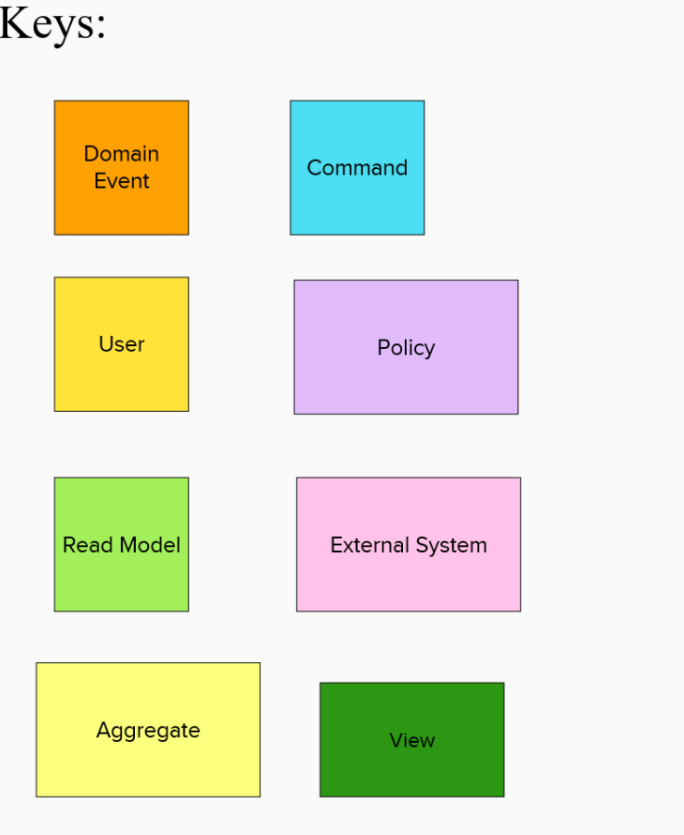
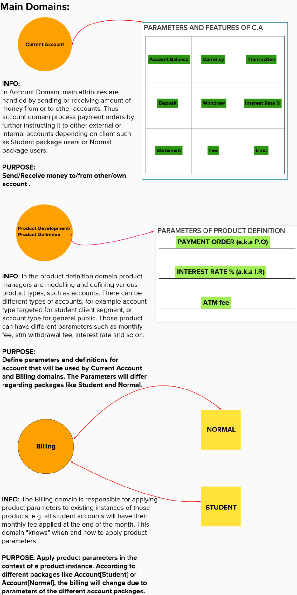
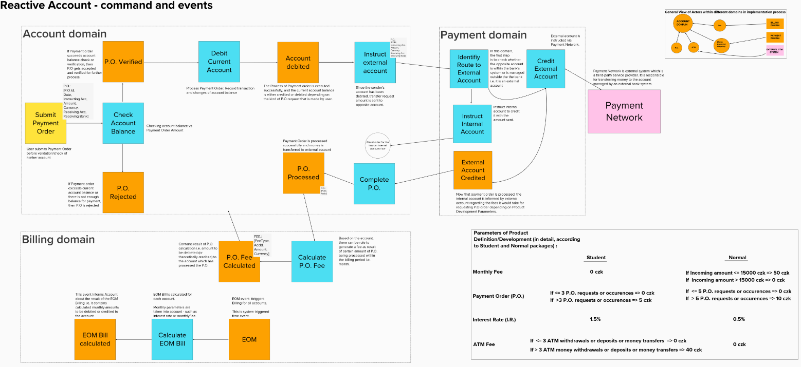
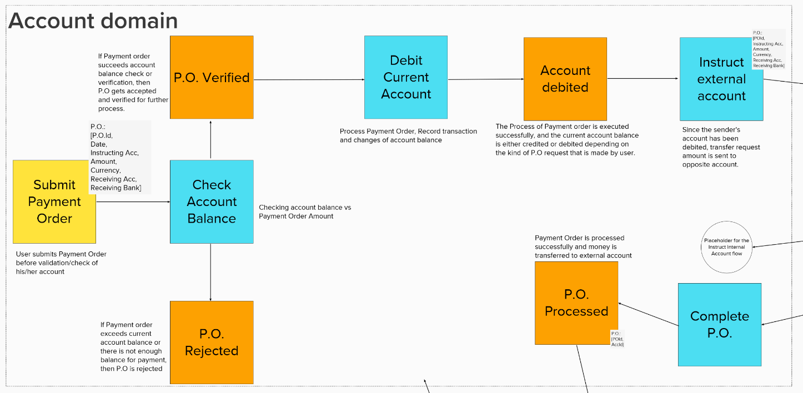
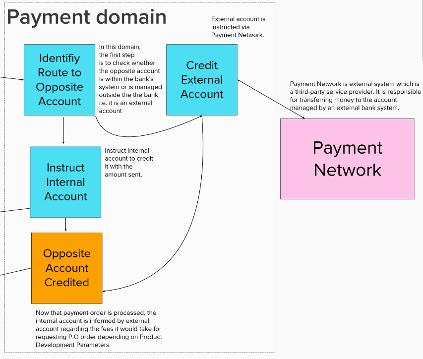
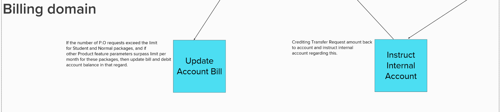

# Reactive Microservices Engineering and Design

# **Reactive Account** #

[](https://developer.ibm.com/technologies/reactive-systems/)

### Libraries And Technologies
* **[**Java**](https://docs.oracle.com/javase/tutorial/index.html)** -  **General-purpose, concurrent, strongly typed, class-based object-oriented programming language**
* **[**AKKA**](https://akka.io/)** - **Toolkit for building highly concurrent,distributed,resilient,message-driven applications for Java and Scala**
* **[**Microservices**](https://en.wikipedia.org/wiki/Microservices)** - **Architectural style that structures application as collection of highly maintainable,testable services**
* **[**Docker**](https://www.ibm.com/cloud/learn/docker)** - **Open Source platform for building, deploying, and managing containerized applications.**

### Design Techniques and Principles

* **[**Domain-Driven Design**](https://en.wikipedia.org/wiki/Domain-driven_design)** -  **Approach to develop software for complex needs by deeply connecting the implementation to an evolving model of the core business concepts**
* **[**Reactive Principles**](https://www.reactivemanifesto.org/)**: 

****

* **[**Event Storming**](https://en.wikipedia.org/wiki/Event_storming)** - **Workshop-based method to quickly find out what is happening in the domain of a software program**


### Installation of neccessary packages

Install the dependencies:

```sh
# Check whether python installed:
$ python --version

# Check whether pip installed:
$ python -m pip --version

# If above all installed:
$ pip install -r requirements.txt

# Try upgrading pip:
$ pip install --upgrade pip
```


### Project Visualization, Implementation, Design Details






# Reactive Account Design: Main Outlook 





# All domains inside Reactive Account (separetely)









