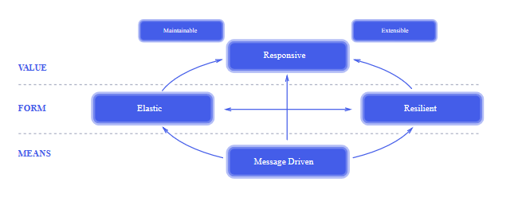
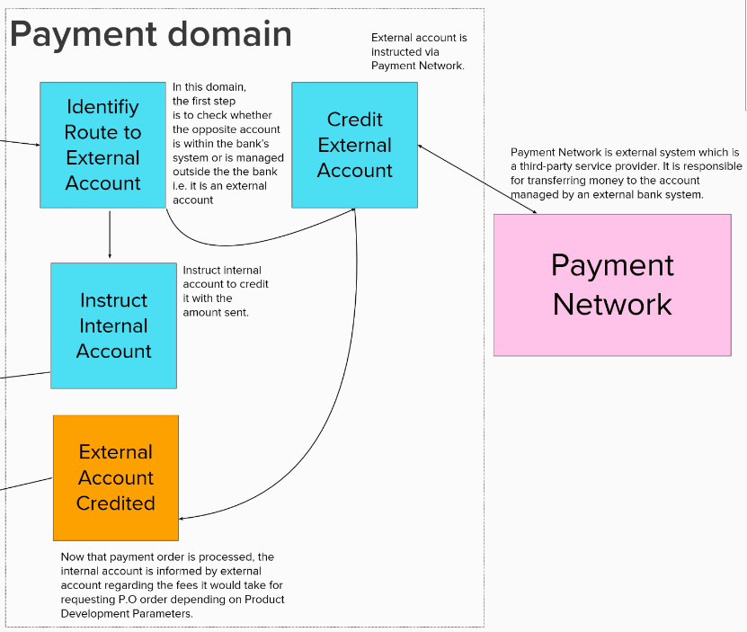
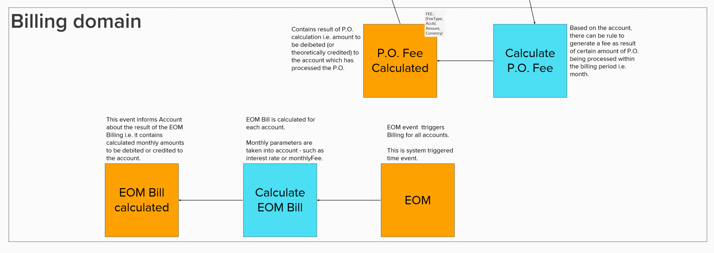
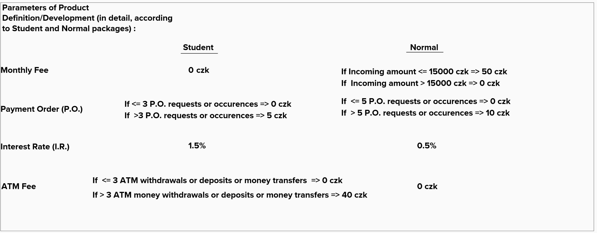
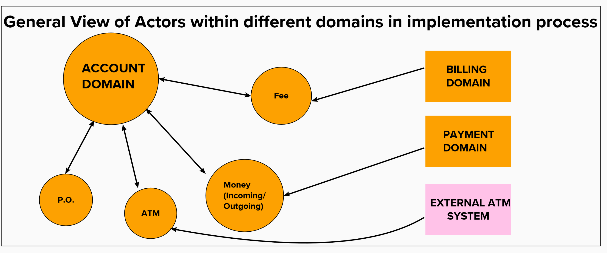

# Reactive Microservices Engineering and Design

# **Reactive Account** #

[](https://developer.ibm.com/technologies/reactive-systems/)

### Libraries And Technologies
* **[**Java**](https://docs.oracle.com/javase/tutorial/index.html)** -  **General-purpose, concurrent, strongly typed, class-based object-oriented programming language**
* **[**AKKA**](https://akka.io/)** - **Toolkit for building highly concurrent,distributed,resilient,message-driven applications for Java and Scala**
* **[**Microservices**](https://en.wikipedia.org/wiki/Microservices)** - **Architectural style that structures application as collection of highly maintainable,testable services**
* **[**Docker**](https://www.ibm.com/cloud/learn/docker)** - **Open Source platform for building, deploying, and managing containerized applications.**

### Design Techniques and Principles

* **[**Domain-Driven Design**](https://en.wikipedia.org/wiki/Domain-driven_design)** -  **Approach to develop software for complex needs by deeply connecting the implementation to an evolving model of the core business concepts**
* **[**Reactive Principles**](https://www.reactivemanifesto.org/)**: 

****

* **[**Event Storming**](https://en.wikipedia.org/wiki/Event_storming)** - **Workshop-based method to quickly find out what is happening in the domain of a software program**


### Installation of neccessary packages

Install the dependencies:

```sh
# Check whether python installed:
$ python --version

# Check whether pip installed:
$ python -m pip --version

# If above all installed:
$ pip install -r requirements.txt

# Try upgrading pip:
$ pip install --upgrade pip
```

### Running the source file

Command:

```sh
# This will compile and run all main actors in source file
$ mvn compile exec:exec
```

### Testing the source file

Command:

```sh
# This will run all tests those are written for each actors in all domains
$ mvn test
```

```sh
# This will run specific test or tests that you specify (its name or path)
$ mvn test -Dtest=TestName#xyz
# where TestName is the test class name and xyz is the test method
# this will run all methods inside class name TestName
$ mvn test -Dtest=TestName 
```

```sh
# For integration tests use it.test=... option instead of test=...
$ mvn -pl <module-name> -Dit.test=TestCircle#xyz integration-test
```

### Deployment

```sh
# reactive-account.jar exists in target which contains src, target, maven dependencies, jre system library

# Creating docker image:
$ docker build -f Dockerfile -t reactive-account .

# List images
$ docker images

# Running docker image
$ docker run -p <port_number>:<port_number> reactive-account

```

### Project Visualization, Implementation, Architecture and Design details


# Reactive Account Architecture and Design: Main Outlook 


# All domains inside Reactive Account (separetely)







# Product Definition/Development Parameters (for Student and Normal packages)





# General View of Domain Event Connections as Actors during technical implementation




# References
- https://akka.io/docs/
- https://docs.docker.com/
- https://stackoverflow.com/search?q=akka%20actor
- https://academy.lightbend.com/
- https://cognitiveclass.ai/?s=reactive
- https://github.com/akka/akka
<<<<<<< HEAD
=======

>>>>>>> 43da27f72a6aaba7016fc783007080bae2889b89
